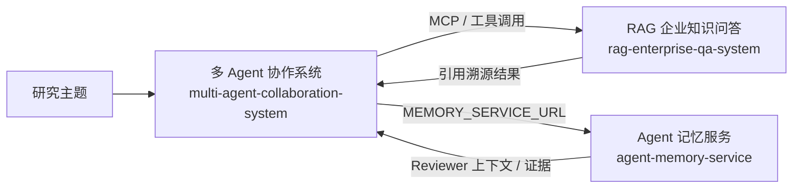

# AI Agent / RAG 项目集

本仓库以**多目录（monorepo）形式**收纳多个可独立开发、独立部署的子项目，整体覆盖「多 Agent 协作编排 → Agent 任务内记忆 → 企业知识检索问答」的 Agent 工程链路，另含一个受控的采购业务演示系统。

## 项目总览

| 子项目 | 目录 | 一句话简介 | 核心技术栈 | 默认入口 |
|---|---|---|---|---|
| 多 Agent 协作系统 | `multi-agent-collaboration-system/` | LangGraph 多 Agent 协作，自动生成万字级企业研报与竞品情报 | Python · LangGraph · FastAPI · Redis · PostgreSQL · MCP | `:8000` |
| Agent 记忆服务 | `agent-memory-service/` | 面向长任务 Agent 的任务内分层记忆服务 | Python · FastAPI · PostgreSQL · Redis · sentence-transformers | `:8084` |
| RAG 企业知识问答 | `rag-enterprise-qa-system/` | 企业私有化文档知识问答，权限过滤 + 混合检索 | FastAPI · PostgreSQL/pgvector · Redis · DeepSeek | `:8090` |
| 智能采购演示系统 | `demo/` | 采购业务全链路本机演示（受控版本） | Windows + WSL2 · Docker Compose | `127.0.0.1:19320` |
| 可信采购 Agent | `trusted-procurement-agent/` | 钢材/工业品采购全链路 Agent，重点是「写操作必须人工审批」的治理与可量化评测 | Python（零第三方依赖） · DeepSeek 可插拔 · Docker 沙箱 · hash-chain 审计 | `127.0.0.1:8765` |

## 系统关系

三个 AI 服务可协同组成一条完整链路：**RAG 系统作为知识检索底座（通过 MCP 暴露给 Agent）**，**记忆服务为长任务提供跨阶段上下文**，**多 Agent 协作系统负责编排 Planner / Executor / Reviewer** 完成研报与情报分析。



---

## 1. multi-agent-collaboration-system — 多 Agent 协作系统

企业级自动化研报与竞品情报分析平台：输入研究主题，自动完成数据采集、分析、整合并生成专业深度研报。

- **DAG 依赖执行**：基于拓扑排序的层级并行执行
- **多 Agent 角色**：Planner（规划）/ Executor（执行）/ Reviewer（质量审核）
- **质量保障**：Reviewer 审核带熔断降级机制
- **MCP 工具集成**：搜索、金融数据、数据清洗等标准化工具服务器
- **状态与可观测**：LangGraph Checkpointer + Redis 分布式锁；Langfuse + Prometheus 监控
- **部署形态**：Docker Compose / Kubernetes 均可

> 快速开始与完整说明见 [multi-agent-collaboration-system/README.md](multi-agent-collaboration-system/README.md)。

## 2. agent-memory-service — Agent 记忆服务

面向长任务 Agent 的任务内分层记忆服务，为多 Agent 系统提供记忆能力。

- 证据摘要与任务内分层记忆管理
- BM25 + 语义向量**混合检索**（默认 `BAAI/bge-small-zh-v1.5`，512 维）
- Reviewer 上下文组装、重试反馈、任务清理
- 主要接口：`POST /tasks/{task_id}/evidence`、`/feedback`、`/reviewer-context`，`GET /retry-feedback`、`/evidence/{source_task}`，`DELETE /tasks/{task_id}` 等

```bash
docker compose up -d --build
# API 文档 http://localhost:8084/docs ，健康检查 http://localhost:8084/health
```

> 快速开始与完整说明见 [agent-memory-service/README.md](agent-memory-service/README.md)。

## 3. rag-enterprise-qa-system — RAG 企业知识问答系统

企业私有化内部文档知识问答系统，面向私有化部署场景。

- **权限前置过滤**：检索前按权限收敛候选集
- **混合检索**：BM25 + pgvector 语义向量，权重可配置
- **多格式解析**：Word / PDF / PPT / Excel，含表格行级切片
- **可信问答**：引用注入、后验映射、低置信度拒答兜底
- **MCP 服务端点**：供多 Agent 系统（如本项目 multi-agent-collaboration-system）标准调用

```bash
python -m pytest -q        # 运行测试
python -m src.main         # 启动服务，默认 :8090
```

> 快速开始与完整说明见 [rag-enterprise-qa-system/README.md](rag-enterprise-qa-system/README.md)。

## 4. demo — 智能采购演示系统（本机受控版）

基于授权源码快照的洁净重建演示版，在个人 Windows 11 + WSL2 环境完整保留采购业务代码、页面、接口、状态机、角色权限、算法与审计规则；**不携带公司历史数据库、客户文件或生产凭据**。

- 一键脚本：`setup.ps1 -GenerateEnvironment`、`demo.ps1 start` / `stop` / `backup` / `restore`
- 访问入口：<http://127.0.0.1:19320/>（端口仅绑定本机 `127.0.0.1:19320-19326`）
- 详细说明见 `demo/` 下的 `docs/00-快速开始.md`

> ⚠️ 本项目为**个人本机受控演示版本**，源码分发受书面授权约束（不公开、不另行分发）。如需随本仓库公开，请先确认授权范围与仓库可见性。

## 5. trusted-procurement-agent — 可信采购 Agent（治理与评测演示）

面向 **钢材 / 工业品采购** 的 Agent，重点不是「能不能聊天」，而是**会治理 + 会评测**：只读操作自动执行，
**任何写 / 改操作都必须人工审批**，并用 67 个 golden 用例把「守得住」这件事量化成真实数字。

- **四道防线**：① 审批门禁 —— 写操作默认审批，含审批人权限矩阵（等级不足的签字判为越权）与
  ≥100 万两名高管会签；② 来源绑定 —— 写操作参数必须与最初从用户输入解析出的需求一致；
  ③ 提示注入双防线 —— 入口拦截 + 工具输出先清洗再进上下文；④ hash-chain 防篡改审计 + 执行沙箱（不可用时 fail-closed）
- **真实评测数字**（`python -m procurement_agent eval`）：分类准确率 **0.8667**、
  越权拦截率 **1.0000**（23 次写操作尝试 / 0 次越权）、防注入成功率 **1.0000**（16/16）、
  引用真实率 **1.0000**（52/52 条引用均真实且本次检索过）
- **模型可插拔**：默认离线模拟大脑，不需要任何密钥即可跑通全链路；配置 `DEEPSEEK_API_KEY` 后可切真实模型，
  并附同批用例的[离线基线 vs DeepSeek 对比报告](trusted-procurement-agent/reports/model_comparison.md)
- **两种演示方式**：双击 `trusted-procurement-agent/一键演示.bat` 打开网页演示
  （实时执行时间线 + 可点击的审批卡片 + 评测仪表盘 + 审计链防篡改演示）；
  或命令行 `python -m procurement_agent demo` / `eval`
- **预留真实系统接入**：只读实现 `ProcurementStore`、写执行实现 `Sandbox`（已提供 HTTP 适配器），
  并配套幂等账本与补偿回滚，接入契约见 [docs/INTEGRATION.md](trusted-procurement-agent/docs/INTEGRATION.md)
- 技术栈：Python 标准库（零第三方依赖）· 可选 DeepSeek · 可选 Docker 沙箱
- 数据全部为脱敏样例，**不含任何真实公司数据**

> 快速开始与完整说明见 [trusted-procurement-agent/README.md](trusted-procurement-agent/README.md)。

---

## 环境与约定

- Python 3.11+；PostgreSQL 15+（含 pgvector）；Redis 7.0+
- 各子项目**只提交 `.env.example`**，真实 `.env` 一律不入库（见根目录 `.gitignore`）
- 每个子项目自带 README 与测试，可独立运行

## License

各子项目版权归各自作者/授权方所有。公开使用前请确认各项目授权与开源许可证。
