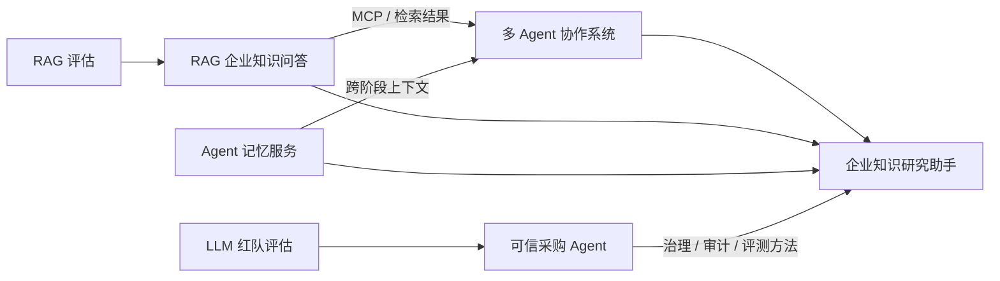

# AI Agent / RAG 工程作品集

本仓库采用 **monorepo** 形式，收录 7 个可独立开发、独立运行的技术项目，覆盖：

**Agent 治理与安全 → 多 Agent 协作 → 任务记忆 → RAG 检索与问答 → 评估与红队测试。**

以下排序按 **技术复杂度、工程闭环、评测强度、可验证性** 综合排列，不代表代码行数或商业价值排序。

---

## 项目总览（技术强度从高到低）

| 排名 | 项目 | 技术定位 | 核心亮点 | 默认入口 |
|---:|---|---|---|---|
| 1 | [trusted-procurement-agent](trusted-procurement-agent/README.md) | 高可信业务 Agent | 治理门禁、双人会签、来源绑定、提示注入双防线、hash-chain 审计、沙箱、67 个 golden 用例 | `127.0.0.1:8765` |
| 2 | [research-agent](research-agent/README.md) | 企业知识研究助手 | LangGraph 多 Agent、分层并行、Redis + pgvector 记忆、Hybrid RAG、引用校验、网页控制台、记忆消融 | `127.0.0.1:8501` |
| 3 | [multi-agent-collaboration-system](multi-agent-collaboration-system/README.md) | 企业多 Agent 协作平台 | Planner / Executor / Reviewer、DAG 层级并行、MCP 工具、Redis 状态、Docker/K8s | `:8000` |
| 4 | [rag-enterprise-qa-system](rag-enterprise-qa-system/README.md) | 企业私有知识问答 | 权限前置过滤、BM25 + pgvector 混合检索、多格式解析、引用回指、MCP 端点 | `:8090` |
| 5 | [agent-memory-service](agent-memory-service/README.md) | Agent 长任务记忆服务 | 证据摘要、分层记忆、混合检索、Reviewer 上下文组装、重试反馈与任务清理 | `:8084` |
| 6 | [RAG-Eval-System](RAG-Eval-System) | RAG 检索/生成评估 | PDF 摄入、检索、生成、评估流水线，适合做 RAG 指标实验 | Python CLI |
| 7 | [LLM-RedTeam-Eval-Engine](LLM-RedTeam-Eval-Engine) | LLM 安全红队评估 | 异步模型客户端、红队用例生成、自动评估器，面向安全性与鲁棒性测试 | Python CLI |

---

## 1. trusted-procurement-agent — 高可信业务 Agent（最高强度）

面向钢材 / 工业品采购的完整 Agent，重点不是“能聊天”，而是 **能治理、能审计、能评测**。

### 核心能力

- **四道防线**：审批门禁、来源绑定、提示注入双防线、hash-chain 审计 + 沙箱
- **写操作默认审批**：审批人权限矩阵、等级不足判越权、大额采购双人会签
- **可回滚执行**：幂等账本、补偿动作、重复提交防护
- **量化评测**：67 个 golden 用例，覆盖分类、越权、注入和引用真实性
- **可插拔模型**：离线模拟大脑即可跑通，也支持 DeepSeek
- **零第三方依赖**：Python 标准库实现核心链路

### 实测指标

- 分类准确率：`0.8667`
- 越权拦截率：`1.0000`
- 防注入成功率：`1.0000`
- 引用真实率：`1.0000`

快速开始：见 [项目 README](trusted-procurement-agent/README.md)。

---

## 2. research-agent — 企业知识研究助手

把 **多 Agent 协作 + 任务记忆 + RAG 引用** 合成一条可演示、可复现、可评测的研究链路。

### 核心能力

- Planner 将主题拆成 5–8 个带依赖的子任务
- 同层任务并行执行，Reviewer 检查完整性、引用真实性和跨分支覆盖
- PostgreSQL + pgvector 保存证据向量，Redis 保存摘要、反馈和任务元数据
- BM25 + BGE 向量 + RRF 混合检索
- 未知 `chunk_id` 自动清洗，报告只保留可回溯引用
- 提供 CLI 和本地网页控制台，支持实时进度、报告阅读、继续追问和指标查看

### 实测指标

| 检索模式 | Recall@5 | MRR |
|---|---:|---:|
| 关键词 BM25 | 1.0000 | 1.0000 |
| 纯向量 | 1.0000 | 0.7812 |
| 混合 RRF | 1.0000 | **0.9688** |

记忆消融在固定 6 任务计划、每步最多 3 条证据、综合至少覆盖 4 个来源的条件下：

- 开启记忆完成率：`100%`（12/12）
- 关闭记忆完成率：`0%`（0/12）
- 开启记忆平均审核分：`0.8583`

启动网页控制台：

```powershell
cd research-agent
powershell -ExecutionPolicy Bypass -File .\scripts\start_ui.ps1
```

访问：<http://127.0.0.1:8501>

快速开始：见 [项目 README](research-agent/README.md)。

---

## 3. multi-agent-collaboration-system — 企业多 Agent 协作平台

面向自动化研报和竞品情报分析的多 Agent 系统。

### 核心能力

- Planner / Executor / Reviewer 三角色协作
- DAG 依赖与拓扑分层，同层任务并行
- Reviewer 熔断、失败回退和降级
- MCP 搜索、金融数据和数据清洗工具服务
- LangGraph Checkpointer + Redis 分布式锁
- Docker Compose 和 Kubernetes 部署文件

快速开始：见 [项目 README](multi-agent-collaboration-system/README.md)。

---

## 4. rag-enterprise-qa-system — 企业私有知识问答

面向私有化部署的企业文档问答系统。

### 核心能力

- 权限前置过滤，缩小检索候选集
- BM25 + pgvector 语义向量混合检索
- Word / PDF / PPT / Excel 解析与表格行级切片
- 引用注入、后验映射和低置信度拒答
- 通过 MCP 端点供其他 Agent 调用

启动：

```bash
python -m pytest -q
python -m src.main
```

Swagger：<http://localhost:8090/docs>

快速开始：见 [项目 README](rag-enterprise-qa-system/README.md)。

---

## 5. agent-memory-service — Agent 长任务记忆服务

面向长任务 Agent 的独立记忆服务，为多 Agent 系统提供跨阶段上下文。

### 核心能力

- 证据摘要和任务内分层记忆
- BM25 + 语义向量混合检索
- Reviewer 上下文组装
- 重试反馈缓存和任务清理
- FastAPI 服务、PostgreSQL、Redis、Docker Compose

启动：

```bash
docker compose up -d --build
```

API 文档：<http://localhost:8084/docs>  
健康检查：<http://localhost:8084/health>

快速开始：见 [项目 README](agent-memory-service/README.md)。

---

## 6. RAG-Eval-System — RAG 检索与生成评估

RAG 指标实验项目，覆盖文档摄入、检索、生成和评估流水线。

### 核心能力

- PDF 摄入与切片
- 检索与生成模块分离
- RAG 自动评估
- 适合作 Recall、MRR、答案质量等实验的基础工程

主要入口：

- `RAG-Eval-System/ingest_data.py`
- `RAG-Eval-System/main.py`
- `RAG-Eval-System/core/evaluation.py`

目录：[RAG-Eval-System](RAG-Eval-System)

---

## 7. LLM-RedTeam-Eval-Engine — LLM 安全红队评估

面向 LLM 安全性与鲁棒性的红队测试基础工程。

### 核心能力

- 异步模型客户端
- 红队攻击用例生成
- 自动评估器
- 适合扩展提示注入、越狱、数据泄露和安全回归测试

主要入口：

- `LLM-RedTeam-Eval-Engine/main.py`
- `LLM-RedTeam-Eval-Engine/core/red_team.py`
- `LLM-RedTeam-Eval-Engine/core/evaluator.py`

目录：[LLM-RedTeam-Eval-Engine](LLM-RedTeam-Eval-Engine)

---

## 项目关系



- **可信采购 Agent** 提供治理、安全、审批、审计和评测范式。
- **research-agent** 把多 Agent、记忆、RAG 和评估整合成完整研究链路。
- **multi-agent-collaboration-system** 提供更完整的协作编排与 MCP 工具生态。
- **rag-enterprise-qa-system** 提供企业知识检索问答底座。
- **agent-memory-service** 提供独立可复用的长任务记忆服务。
- **RAG-Eval-System** 与 **LLM-RedTeam-Eval-Engine** 分别负责 RAG 质量和 LLM 安全评估。

---

## 仓库结构

```text
my-repo/
├── trusted-procurement-agent/
├── research-agent/
├── multi-agent-collaboration-system/
├── rag-enterprise-qa-system/
├── agent-memory-service/
├── RAG-Eval-System/
├── LLM-RedTeam-Eval-Engine/
└── reports/
```

---

## 环境约定

- Python 3.11+
- PostgreSQL 15+，RAG 项目使用 pgvector
- Redis 7.0+
- 各项目优先使用自己的 `README.md` 启动
- `.env`、密钥、缓存和运行日志不提交
- 数据均使用公开资料或脱敏样例

## 授权说明

部分项目或演示材料可能涉及独立授权，公开使用和再分发前应确认对应项目的许可证与授权范围。仓库中的受限演示快照不会在未确认授权的情况下上传。