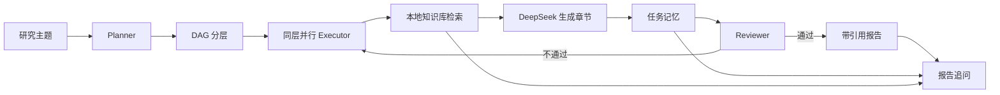

# 企业知识研究助手（research-agent）

把 **多 Agent 协作 + 任务记忆 + RAG 检索** 组合成一个可复现的研究助手：输入研究主题后，系统自动拆解任务、按依赖分层并行调研、从本地知识库检索证据、生成带真实引用的报告，并支持基于任务记忆继续追问。

> 本项目是求职作品中的“广度配角”，重点是三件事能在一条链路中跑通，并用可复现指标说明有效性，不是完整商业平台。演示数据均为本地整理资料，不包含真实公司数据。

## 核心能力

| 能力 | 实现 |
|---|---|
| 多 Agent | Planner 负责 5–8 个子任务和 DAG 拆解；Executor 同层并行；Reviewer 检查完整性、格式和引用真实性 |
| 任务记忆 | Redis 保存任务元数据、摘要和反馈；pgvector 保存可检索的证据与摘要；支持记忆开关消融 |
| RAG | Markdown/TXT/PDF 解析、切片、BM25 关键词检索、BGE 中文向量检索、RRF 混合融合 |
| 引用可信 | LLM 只能引用检索提供的 `chunk_id`；写入前清洗未知引用，Reviewer 二次校验 |
| 工程闭环 | LangGraph 状态机、只读证据提示、重试/降级、结构化 JSON 结果、CLI 一键演示 |

## 快速开始

### 1. 环境要求

- Python 3.11+
- Docker Desktop / Docker Compose
- DeepSeek API Key

### 2. 安装依赖

```powershell
powershell -ExecutionPolicy Bypass -File .\scripts\setup.ps1
.\.venv\Scripts\Activate.ps1
```

如果本机没有现成依赖，`pip install -e ".[dev]"` 会按 `pyproject.toml` 自动安装 FastEmbed、LangGraph、asyncpg 等依赖。

### 3. 配置

```powershell
Copy-Item .env.example .env
# 编辑 .env，填入 DEEPSEEK_API_KEY
```

项目默认使用本地 `BAAI/bge-small-zh-v1.5`。首次运行会下载约 55 MB 的 ONNX 模型；网络受限时可以设置：

```powershell
$env:HF_ENDPOINT = "https://hf-mirror.com"
```

如果只想验证流程、不下载向量模型，可将 `EMBEDDING_MODEL=hash` 作为离线冒烟模式。该模式不具备真实语义检索能力，不能用于最终 RAG 指标。

### 4. 启动基础设施并演示

如果暂时拉不动 pgvector 镜像，可以使用 `--local` 内存后端跑通链路；正式指标仍应使用默认 PostgreSQL/pgvector 后端：

```powershell
.\.venv\Scripts\python.exe -m research_agent.cli demo --local --topic "企业级 AI Agent 技术现状与趋势"
.\.venv\Scripts\python.exe -m research_agent.cli eval-retrieval --local
```

默认 PostgreSQL/pgvector 模式：


```powershell
docker compose up -d --wait
.\.venv\Scripts\python.exe -m research_agent.cli ingest
.\.venv\Scripts\python.exe -m research_agent.cli demo --topic "企业级 AI Agent 技术现状与趋势"
```

也可以运行一键脚本：

```powershell
powershell -ExecutionPolicy Bypass -File .\scripts\demo.ps1
```

## 网页控制台（推荐）

本地单用户浏览器控制台，包含研究运行、实时进度、报告查看、报告追问、评估指标和知识库管理。

```powershell
cd D:\xm\research-agent
powershell -ExecutionPolicy Bypass -File .\scripts\start_ui.ps1
```

脚本会自动启动 PostgreSQL/Redis、启动网页服务并打开：

```text
http://127.0.0.1:8501
```

停止网页控制台：

```powershell
powershell -ExecutionPolicy Bypass -File .\scripts\stop_ui.ps1
```

如果浏览器没有自动打开，手动访问上面的地址。命令行方式仍然保留，适合自动化和复现实验。

## CLI 命令

```text
research-agent doctor                         检查 PostgreSQL、Redis、模型和知识库
research-agent ingest                         解析并重建本地知识库
research-agent demo --topic "研究主题"         运行完整研究流程
research-agent demo --topic "研究主题" --memory off
research-agent ask --task-id <id> --question "继续追问"
research-agent eval-retrieval                 计算 Recall@k / MRR 三路对照
research-agent eval-memory --limit 12         运行开关记忆消融实验\nresearch-agent report-metrics                   汇总生成 Markdown 数字验收报告
```

`demo` 完成后会写入：

- `reports/<task_id>.md`：带来源列表的中文报告
- `reports/<task_id>.json`：任务状态、引用、得分、耗时和错误
- Redis：任务摘要、反馈历史和历史问答，供 `ask` 使用（`--local` 使用进程内替身；`ask` 会回退读取报告 JSON）

## 三个能力如何协同



### 多 Agent

Planner 返回受程序校验的 JSON，必须满足 5–8 个任务、唯一 id、合法依赖和无环。Executor 只执行依赖已完成的节点，同层任务最多 4 路并行。Reviewer 先检查任务状态、章节数、引用真实性和长度，再用 DeepSeek 做 LLM-as-judge，不合格时最多重试一次，仍不合格则保留降级结果。

### RAG

关键词侧使用 jieba + BM25，向量侧使用本地 BGE 模型和 pgvector，混合侧用 RRF 融合。每份文档切片带有 `doc_id`、`chunk_id`、标题和来源，生成前作为只读证据注入提示词；未知 `chunk_id` 会被程序删除。

### 记忆

记忆开启时，已完成任务会写入跨步骤摘要、审查反馈和引用证据；后续任务先按查询检索相关记忆，再与当前证据一起生成。记忆关闭时只保留同一 DAG 直接依赖的结果，不读取跨步骤摘要和反馈缓存。

## 评估设计

### 主指标：记忆消融

`evaluation/research_topics.jsonl` 提供 12 个研究主题。固定模型、提示词、检索器和重试次数，分别以 `memory=on` 与 `memory=off` 运行，完成判定同时要求：

1. Reviewer 确定性校验和 LLM Judge 通过；
2. 所有子任务完成；
3. 报告不存在无法回溯的引用；
4. 综合章节达到跨分支来源覆盖要求。

同一主题的开/关记忆使用完全相同的、知识库可覆盖的固定 6 任务 DAG，只切换记忆模块，避免 Planner 差异和知识库覆盖波动污染消融结果。每个子任务最多使用 3 条当前检索证据；最终综合章节必须覆盖至少 4 个跨分支来源，用来检验前序证据是否能通过记忆传递。`eval-memory` 输出完成率、平均审核分、平均耗时和差值。人工抽检模板位于 `evaluation/manual_review_template.csv`。

### 辅助指标：RAG 检索质量

`evaluation/retrieval_questions.jsonl` 提供 16 个带标准相关文档的问题，对比：

- 纯关键词 BM25
- 纯向量检索
- BM25 + 向量 + RRF 混合检索

输出 `Recall@5`、`MRR` 和样本量，结果保存在 `evaluation/results/retrieval_metrics.json`。

## 实测结果

以下结果由真实 DeepSeek Chat、本地 `BAAI/bge-small-zh-v1.5` 和同一套检索逻辑实际运行生成，完整报告见 [reports/metrics-report.md](reports/metrics-report.md)。

### RAG 检索对照（16 个问题，Recall@5）

| 模式 | Recall@5 | MRR |
|---|---:|---:|
| 关键词 BM25 | 1.0000 | 1.0000 |
| 纯向量 | 1.0000 | 0.7812 |
| 混合 RRF | 1.0000 | **0.9688** |

### 记忆消融（12 个研究主题，固定模型与检索器）

| 记忆模式 | 任务完成率 | 平均审核分 | 平均耗时 |
|---|---:|---:|---:|
| 开启记忆 | **100.00%** | **0.8583** | 28.47s |
| 关闭记忆 | 0.00% | 0.8000 | 21.88s |

完成率提升 **100 个百分点**。消融条件为：同一主题使用固定 6 任务计划，每个子任务最多使用 3 条当前检索证据，最终综合至少覆盖 4 个跨分支来源。关闭记忆时，所有样本只能覆盖 3 个来源，因此均未通过综合完整性校验；开启记忆后，前序证据可随任务记忆传入综合阶段，12/12 通过。

这组数字验证的是“记忆能否把跨步骤证据带到后续步骤”这一机制，不代表开放域任务上的通用提升。正式全量实验已在 PostgreSQL 18 + pgvector 0.8.1 + Redis 上完成；本机通过 `docker/postgres/Dockerfile` 构建了可离线复现的数据库镜像，正式模式示例见 [reports/postgres-demo.md](reports/postgres-demo.md)。

## 项目结构

```text
research-agent/
├── src/research_agent/
│   ├── agents.py       # Planner / Executor / Reviewer
│   ├── graph.py        # LangGraph 编排与分层并行
│   ├── rag.py          # 文档解析、BM25、向量与 RRF
│   ├── storage.py      # PostgreSQL/pgvector + Redis
│   ├── embedding.py    # FastEmbed / hash 离线模式
│   ├── llm.py          # DeepSeek 兼容接口
│   ├── cli.py          # CLI 入口
│   ├── web_app.py      # FastAPI 网页控制台
│   └── web_ui.html     # 本地单页界面
├── docker/postgres/    # 可本地构建的 PostgreSQL + pgvector 镜像
├── knowledge_base/     # 演示知识库
├── evaluation/         # 检索题集、研究主题、人工抽检模板
├── scripts/            # 初始化、演示和实验脚本
└── tests/              # 单元测试与离线端到端测试
```

## 安全与边界

- 知识库内容视为不可信数据，不把文档中的指令当作系统指令；
- 不包含真实公司数据，所有演示资料均为本地公开资料整理；
- `.env` 不入库，`.env.example` 只保留占位符；
- 引用只能来自本次检索，未知引用会被清洗；
- 这是 MVP，权限过滤、OCR、重排、监控和多租户隔离是后续工作，不应在简历中夸大为已实现能力。

## 当前完成度

- [x] CLI 主流程和 LangGraph 编排
- [x] 本地网页控制台与实时任务进度
- [x] 本地知识库与三种检索模式
- [x] 记忆写入、读取和开关
- [x] 引用清洗与 Reviewer 重试
- [x] 离线端到端测试
- [x] 在 pgvector/Redis 容器上完成真实全量实验
- [x] 填写实测记忆消融与检索指标